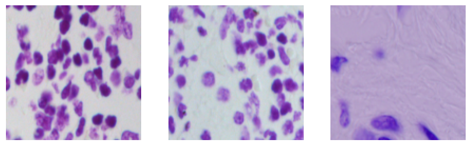
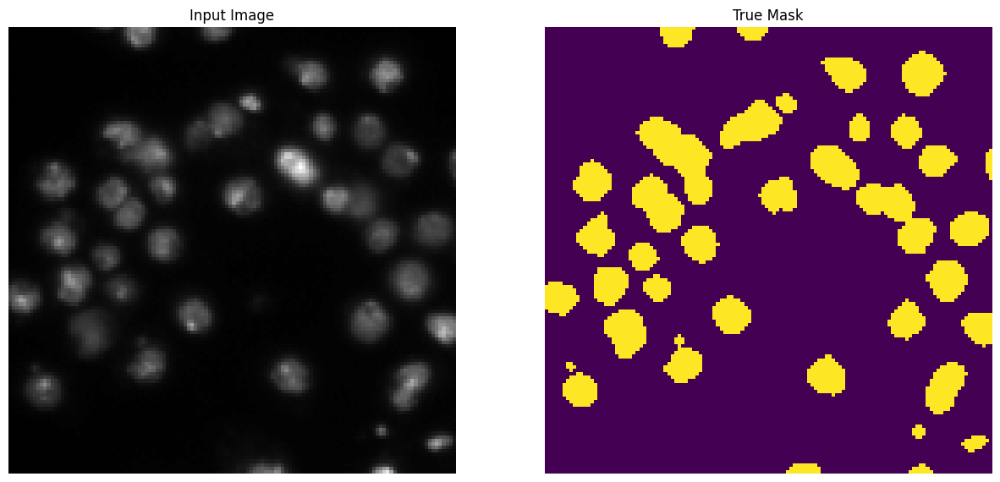
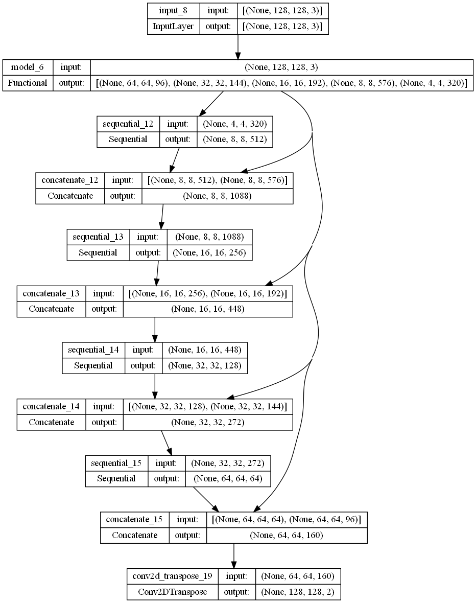
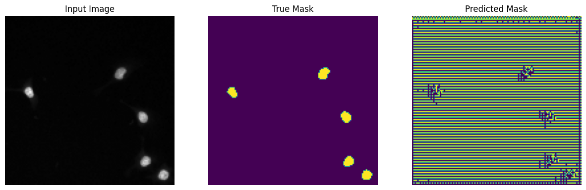
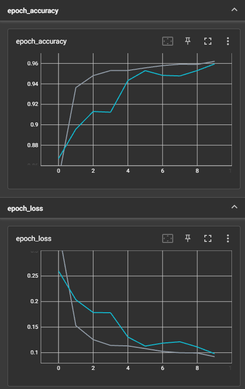
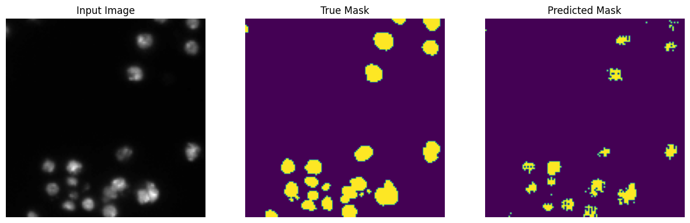

# Image_Segmentation
 An algorithm that can automatically detect nuclei to expedite research on a wide
range of diseases, including cancer, heart disease, and rare disorders. Such tool has
the potential to significantly improve the speed at which cures are developed,
benefiting those suffering from various health conditions, including chronic
obstructive pulmonary disease, Alzheimer's, diabetes, and even the common cold.
Hence, the identification of cell nuclei is a crucial first step in many research studies
because it enables researchers to analyze the DNA contained within the nucleus,
which holds the genetic information that determines the function of each cell. By
identifying the nuclei of cells, researchers can examine how cells respond to
different treatments and gain insights into the underlying biological processes at
play. An automated AI model for identifying nuclei, offers the potential to streamline
drug testing and reduce the time for new drugs to become available to the public.

#### 1. Data Loading
        -Load dataset using OpenCV. The image was loaded in RGB format (3 channel) while the masks in grayscale (1 channel). The image is as dispalyed below.

#### 2. Data Preprocessing
        -The input images and masks images is normalized to 255. Both image and masks is split using scikitlearn.model_selection method, train_test_split().

  

#### 3. Model Development
        -The MobileNetV2 will be use as a feature extraction with frozen layers. The downsampled image will then be upsampled using the U-Net model. The U-Net model structure can be seen below.

#### 4. Model evaluation
        -The model were evaluate using train inputs image and true mask to sse the predicted mask before the model training. The ressult can be seen below.

 

Training Evaluation 

From the the graph, the training shows that the model is overfiting. 

After Training 

## Acknowledgements
The Dataset used is obtained from [Kaggle](https://www.kaggle.com/competitions/data-science-bowl-2018/overview)
